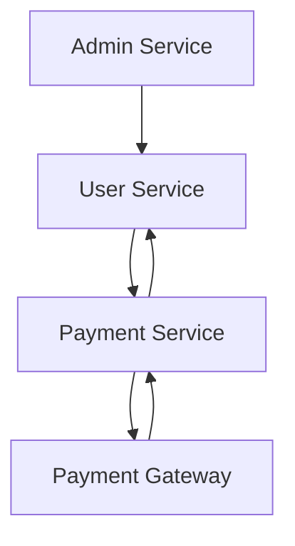

# Sacler - Coupon Generator – Retail Store Management Application

A backend microservices application that allows retail store owners to manage promotional coupon templates, generate personalized coupons, and handle subscription payments via third-party payment gateways.

---

## 📁 Project Structure

```
coupon-generator/
├── admin/          # Admin microservice
├── user/           # User microservice
├── payment/        # Payment microservice
└── README.md       # Root documentation
```

---

## ⚙️ Tech Stack

- Java 17
- Spring Boot
- Spring Security + JWT
- Spring Data JPA
- MySQL
- Docker
- AWS (EC2, RDS)
- Razorpay / Stripe integration
- Postman
- Lombok

---

## 🧩 Microservices Overview

### Admin Service
- Login with JWT authentication
- Create and manage subscription plans
- Manage users (business owners)

### User Service
- Login with JWT authentication
- View plans
- Create coupon templates
- Generate coupons linked to customers
- Request payment ID for subscription renewal

### Payment Service
- Integrates with Razorpay / Stripe
- Generates payment links
- Processes payment callbacks
- Updates subscription status

---

## 🚀 Setup Instructions

### 1. Clone the repository
```bash
git clone https://github.com/your-username/coupon-generator.git
cd coupon-generator
```

### 2. Create MySQL databases
```bash
mysql -u root -p

-- In MySQL prompt:
CREATE DATABASE coupongenerator
```

### 3. Configure environment
Update `application.properties` or `application.yml` in each service with database and JWT config.

### 4. Run Services
```bash
cd admin && ./mvnw spring-boot:run
cd ../user && ./mvnw spring-boot:run
cd ../payment && ./mvnw spring-boot:run
```

---

## 🔗 Service Interaction Diagram (Mermaid)



---

## 📮 API Testing with Postman
- Test login and get JWT token
- Use token in `Authorization: Bearer <token>` header
- Test coupon creation, plan management, and payments

---

## 🧠 Design Patterns Used

- **Strategy Pattern** for payment gateway selection
- **Abstract Factory Pattern** for payment provider injection
- **Layered Architecture**: Controller → Service → Repository
- **DTO Pattern** for request/response abstraction

---

## 🛠 Future Improvements

- Add React frontend
- Email/SMS coupon delivery integration
- Admin analytics dashboard
- Caching with Redis or Spring Cache
- Async events via Kafka or RabbitMQ

---

## 📄 License
This project is built for academic purposes and is open for personal or educational use.
